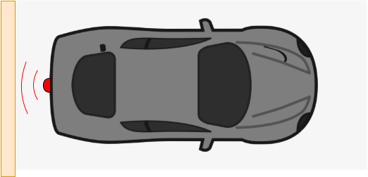

# Parkovací asistent
[Odkaz na GitHub](https://github.com/Dan5049/DE1-project)

### Členové týmu
Fabula Boris      [GitHub](https://github.com/bfbl/Digital-electronics-1)  
Havránek Daniel   [GitHub](https://github.com/Dan5049/Digital-electronics-1)   
Hlaváček Jakub    [GitHub](https://github.com/Jakubhl/Digital-electronics-1)   
Horna Aleš        [GitHub](https://github.com/xhorna16/Digital-electronics-1)

### Cíl projektu
 

* Cílem projektu je vytvoření parkovacího asistentu. Základní verze obsahuje jeden ultrazvukový senzor HC-SR04, bargrafem realizovaným pomocí LED integrovaných na desce a zvukuvou signalizací pomocí bzučáku.
* V druhé verzi projektu je plánováno nahradit LED optickou signalizaci externího bargrafu.
* V třetí verzi projektu je plánováno použití třech ultrazvukových senzorů namísto jednoho. Pro optickou signalizaci bude za potřebí využít třech bargrafů - každý pro jeden senzor. Zvuková signalizace pomocí bzučáku bude poté pro nejkritičtejší hodnotu.

## Popis hardwaru
### Tabulka propojení
| **Signál**| **Výstupní pin** | **FPGA pin** | **FPGA package pin** |
| :-: | :-: | :-: | :-: |
| rst | btn[0] | IO_L6N_T0_VREF_16 | D9 |
| echo_i | jc[0] | IO_L20P_T3_A08_D24_14 | U12 |
| trig_o | ja[0] | IO_0_15 | G13 |
| buzz_o | ja[1] | IO_L4P_T0_15 | B11 |

 

### Tabulka propojení bragrafu
| **Signál -> leds_o**| **Výstupní pin** | **FPGA pin** | **FPGA package pin** |
| :-: | :-: | :-: | :-: |
| 0 | ja[2] | IO_L4N_T0_15 | A11 |
| 1 | ja[3] | IO_L6P_T0_15 | D12 |
| 2 | ja[4] | IO_L6N_T0_VREF_15 | D13 |
| 3 | ja[5] | IO_L10P_T1_AD11P_15 | B18 |
| 4 | ja[6] | IO_L10N_T1_AD11N_15 | A18 |
| 5 | ja[7] | IO_25_15 | K16 |
| 6 | jb[0] | IO_L11P_T1_SRCC_15 | E15 |
| 7 | jb[1] | IO_L11N_T1_SRCC_15 | E16 |
| 8 | jb[2] | IO_L12P_T1_MRCC_15 | D15 |
| 9 | jb[3] | IO_L12N_T1_MRCC_15 | C15 |

 

### Blokové schéma

 

Na blokovém schématu můžeme vidět princip fungování. *Clock generator* nám generuje hodinový signál o frekvenci 100MHz, který je přiváděn do bloku *Trigger generator* a *Distance counter*. Další vstup do obou bloků je *reset*. 

Blok *Trigger generator* generuje řídící signál pro senzor *HC-SR04*. Tento signál je 10μs v hodnotě 1 a poté v hodnotě 0. Perioda tohoto signálu je 100ms.

Výstup ze senzoru *HC-SR04* je přiváděn do bloku *Distance counter* jako signál *echo*. Podle délky tohoto signálu je zjištěna vzdálenost od objektu. Podle vzdálenosti od objektu se rozsvítí určitý počet LED a nastaví se délka pípání bzučáku.

 

### DPS
#### Schéma zapojení přídavné desky

#### Náhled desky

 

Blok optické a akustické signalisace
* bargraf s 10 LED se spojenými katodami je přes předřadné odpory připojen na příslušné výstupy FPGA
* samokmitající bzučák, napájený z 5V, je spínán tranzistorem MOSFET, ovládaným z výstupu FPGA
* dále jsou obsaženy dva převodníky úrovní mezi 3,3V a 5V využité pro komunikaci mezi FPGA a ultrazvukovým snímačem
Převodníky úrovní
* řeší problém odlišných napětí odpovídajících logickým úrovním 1 na hlavní desce (s FPGA) a ultrazvukovém snímači
* jako zdroje napětí 3,3V a 5V použijí se příslušné výstupy na hlavní desce
* přenáší úroveň z jedné strany na druhou činností tranzistoru MOSFET
* vstup pro úroveň s určitým napětím označen jako I3, resp. I5, podle napětí
* výstup pro úroveň s určitým napětím označen jako O3, resp. O5, podle napětí
* vysvětlení funkce na příkladu:
	* na I3 je úroveň log. 0 (0V), T1 je otevřen (UGS=3,3V), úroveň 0 se tak přenese na výstup O5, kde bude napětí blízké nule (T1 otevřen)
	* na I3 je úroveň log. 1 (3,3V), T1 je uzavřen (UGS=0V), úroveň 1 se tak přenese na výstup O5, kde bude napětí 5V (T1 uzavřen)
	* funkce druhého převodníku je analogická
Praktické provedení
* většina součástek v provedení SMD, odpory-1206, tranzistory-SOT23, přesné informace v souboru "seznam-soucastek.txt"
* tranzistory jsou MOSFET, typ 2N7002, prahové napětí UGSth, povolený proud ID a další parametry jsou postačující
* jednostranná DPS, připojení k hlavní desce realisuje se pomocí páskových vodičů pájených do DPS bloku signalisace, na straně desky s FPGA připojeny pomocí vhodného konektoru
* na DPS vyznačena místa pro vyvrtání otvorů pro eventuální uchycení 4 šrouby M3
* bargraf může být osazen do patice DIL, což usnadní případnou výměnu za jiný typ (jiná barva světla)

## VHDL moduly a simulace

## TOP modul a simulace

## Video

## Reference
1. https://github.com/Digilent/digilent-xdc/blob/master/Arty-A7-100-Master.xdc
2. https://www.electroschematics.com/wp-content/uploads/2013/07/HCSR04-datasheet-version-1.pdf
3. https://github.com/tomas-fryza/Digital-electronics-1
4. https://app.diagrams.net/
5. https://vhdlwhiz.com/basic-vhdl-tutorials/
